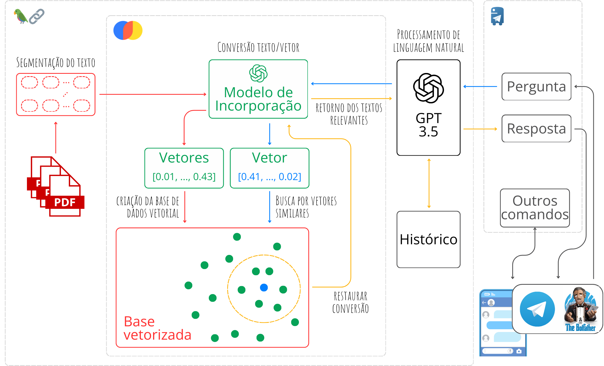

# Agente informacional contextual com IA e PLN integrado ao Telegram
Este projeto visa fornecer informações contextuais relevantes via Telegram, utilizando um modelo GPT integrado ao framework LangChain. Este chatbot utiliza inteligência artificial e processamento de linguagem natural para criar interações fluídas e informativas.
A metodologia envolveu a utilização de arquivos em PDF como base de dados, assegurando a precisão das informações fornecidas pelo chatbot, com implementação na linguagem Python e o modelo GPT-3.5 Turbo da OpenAI. A ferramenta BotFather do Telegram foi utilizada para simplificar a criação e administração do agente. O framework LangChain facilitou a integração entre o modelo de linguagem e a interface do Telegram, proporcionando uma experiência interativa eficiente, assegurando um arquitetura do sistema de modo a permitir o acesso imediato a informações relevantes do banco de dados.

<p align="center">
  
  <br>
  <em>Fonte: @abner-lucas, 2023</em>
</p>

## Funcionalidades
- Responde a perguntas sobre educação ambiental e saneamento básico com base no Manual do Saneamento da FUNASA.
- Utiliza o modelo GPT-3.5 Turbo da OpenAI para gerar respostas.
- Integração com o Telegram para interação em tempo real.
- Recupera informações contextuais relevantes diretamente de uma base de dados estruturada.
- Fornece uma experiência de conversação natural e contínua.

## Estrutura do Projeto
- `main.py`: Script principal que inicializa e executa o chatbot.
- `requirements.txt`: Arquivo de requisitos com as dependências necessárias.
- `backend_chatbot.ipynb`: Notebook Jupyter para desenvolvimento e testes do backend do chatbot.

## Requisitos
- `python-telegram-bot`
- `langchain`
- `requests`
- `Chroma`
- `chromadb`
- `pypdf`
- `openai==0.28`
- `tiktoken`
- `deep-translator`

## Instalação
1. Instale as dependências:
    ```bash
    pip install -r requirements.txt
    ```

## Uso
1. Defina as variáveis de ambiente com seu token do Telegram e chave da API OpenAI no arquivo `main.py`:
    ```python
    chave_bot = "SUA CHAVE AQUI"  # chave bot Telegram
    chave_gpt = "SUA CHAVE AQUI"  # chave API OpenAI
    nome_modelo = "gpt-3.5-turbo-16k"  # mudar de acordo com o modelo da chave
    ```
2. Execute o bot:
    ```bash
    python main.py
    ```

## Produções Científicas
Este projeto é um produto de dois projetos distintos:

- **Agente Ambiental**: Um chatbot que utiliza técnicas de IA e PLN para promover a educação ambiental com foco no saneamento básico, desenvolvido para interagir de maneira natural com os usuários, fornecendo informações contextuais baseadas no Manual do Saneamento da FUNASA.
- **IFPAssistente**: Um agente conversacional integrado ao Processamento de Linguagem Natural com o Telegram, visando fornecer informações contextuais sobre os cursos do IFPA Campus Breves baseados nos Projetos Pedagógicos de Curso.

### Referências
- FURTADO, G. S.; PEREIRA, Ábner L. A. Chatbot para Educação Ambiental e Saneamento Básico: uma abordagem com IA e PLN. In: I Congresso Marajoara de Ciências, Educação e SocioBiodiversidade, 2024, Breves. Anais do I Congresso Marajoara de Ciências, Educação e SocioBiodiversidade. Breves: UFPA, 2023.
- [IFPAssistente - Um agente conversacional com recuperação contextual de informações do IFPA Campus Breves](https://www.even3.com.br/ebook/xv-sicti/788608-ifpassistente--um-agente-conversacional-com-recuperacao-contextual-de-informacoes-do-ifpa-campus-breves/)

## Autor
- [@abner-lucas](https://github.com/abner-lucas)
  
## Licença
Este projeto está licenciado sob a licença MIT. Veja o arquivo [MIT](https://choosealicense.com/licenses/mit/) para mais detalhes.
